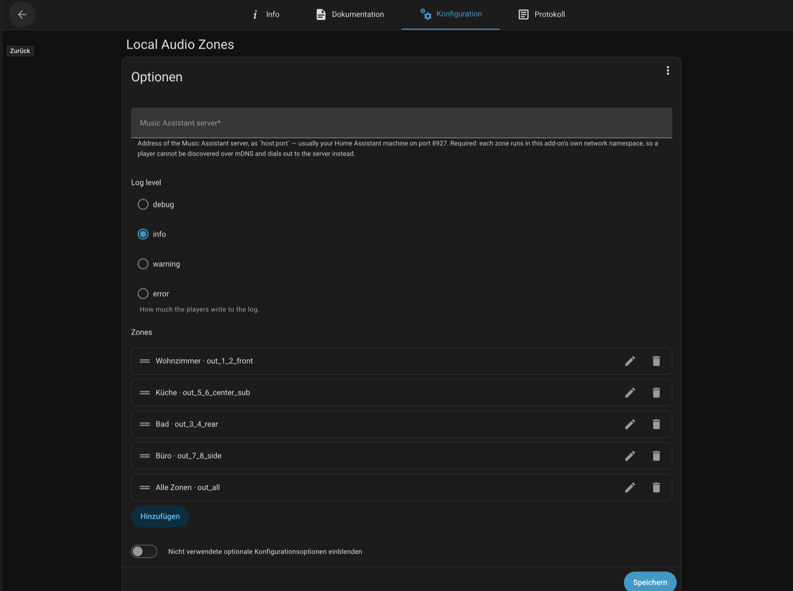

# Home Assistant Add-ons

An add-on repository for Home Assistant. Once added under **Apps** (Home
Assistant's add-on store, formerly "Add-on Store"), every add-on it contains
shows up there — with update notifications like any other add-on.

**Not via HACS.** HACS handles custom integrations, Lovelace cards and themes;
add-ons run through the Supervisor and therefore through **Apps** (the add-on
store). That is not a detour but the intended path: it is the same mechanism the
official add-ons come through.

## Adding the repository

> **Not via HACS.** These are Home Assistant **add-ons**, not integrations,
> Lovelace cards or themes — they are added through Home Assistant's **Apps**
> section (the add-on store, formerly "Add-on Store"), not through HACS.
> Available on HAOS/Supervised, not on Home Assistant Container/Core.

**Settings → Apps → ⋮ (top right) → Repositories**, paste the URL below and
click **Add** (on older Home Assistant: **Settings → Add-ons → Add-on Store →
⋮ → Repositories**):

```
https://github.com/sunnyhd/ha-addons
```

The repository has to be publicly reachable for this — the Supervisor clones it
without authentication.

## Included add-ons

### Local Audio Zones

Splits one multi-channel audio output into independent stereo zones and plays
each as its own Sendspin player for Music Assistant. An eight-channel interface
becomes four stereo zones — each with its own volume, queue and group
membership — plus one zone that plays to every output at once.

At startup the add-on reads the channel map of the output that `audio: true`
maps in, creates one `module-remap-sink` per output pair in Home Assistant's
PulseAudio, and starts one `sendspin-cli` per zone. All players run in a single
container, each on its own port (8928 upward) and with its own stable
`SENDSPIN_ID`. A watchdog restarts a crashed player and recreates the sinks if a
restart of the audio plugin removes them.

**Configuration** (entirely in the add-on UI — no file on the host, no Docker
access, no disabled protection mode):

| Option | Meaning |
| --- | --- |
| `server` | Address of the Music Assistant server (`host:port`, usually `<ha-ip>:8927`). **Required** — without host networking there is no mDNS, so the player dials out. |
| `zones` | One entry per zone: `name` (display name in MA) and `output` (output pair, e.g. `out_3_4_rear`). Add as many as the interface has pairs. |
| `master_sink` | Which multi-channel output to split. Empty = the first one with more than two channels. |
| `buffer_ms` | Buffer per player in milliseconds, against dropouts on slow systems. |
| `log_level` | `debug` … `error`. |



**Tested with** an ESI GIGAPORT eX (USB, 8 outputs). The approach is not tied to
this model, though: the add-on reads the output's channel map at runtime rather
than assuming a device. Other multi-channel USB interfaces — and in principle
any sound card that Home Assistant's PulseAudio exposes with a multi-channel
profile — should work as well. Only the GIGAPORT eX is verified so far; other
devices may present a different channel order (then the mapping step from
DOCS.md applies). Feedback on further interfaces is welcome.

What is split are **outputs**. Audio **inputs** (line-in, turntable, microphone)
are not supported yet — the underlying player `sendspin-cli` does not implement
the Sendspin source role; see DOCS.md.

Output mapping, device-dependent channel order, USB power on bus-powered
interfaces and running under HAOS-in-a-VM are described in
[`zone_players/DOCS.md`](zone_players/DOCS.md) or in the app's Documentation
tab.

## Maintenance

The add-on inherits its image from upstream
[music-assistant/local-audio-addon](https://github.com/music-assistant/local-audio-addon)
(`FROM …:<tag>`) — the player (`sendspin-cli`), `pactl` and the base image come
from there; the zone logic is independent of it.

The workflow `.github/workflows/upstream-bump.yml` watches upstream and, on a new
version, automatically opens a pull request that raises the `FROM` tag and the
add-on `version` together (with a test checklist). One-time step required:
enable **Settings → Actions → General → "Allow GitHub Actions to create and
approve pull requests"**. Details and the manual path are in
[`zone_players/DOCS.md`](zone_players/DOCS.md).

## Status

Runs in production against real hardware (ESI GIGAPORT eX, 8 outputs → 4 stereo
zones + "All zones") and a live Supervisor. Two setup pitfalls are recorded in
`DOCS.md`: the device-dependent channel order, and USB power for bus-powered
interfaces (a USB 3 port or a powered hub was needed).
